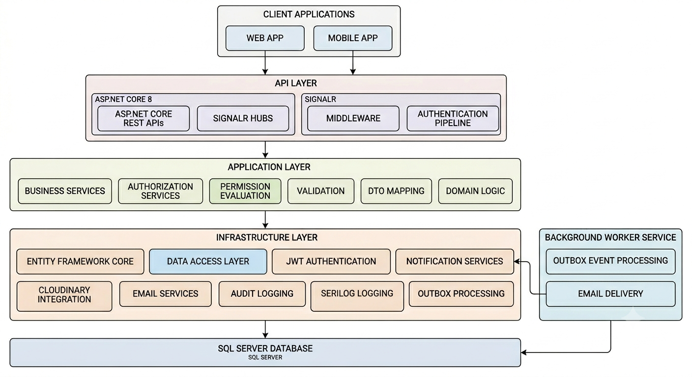
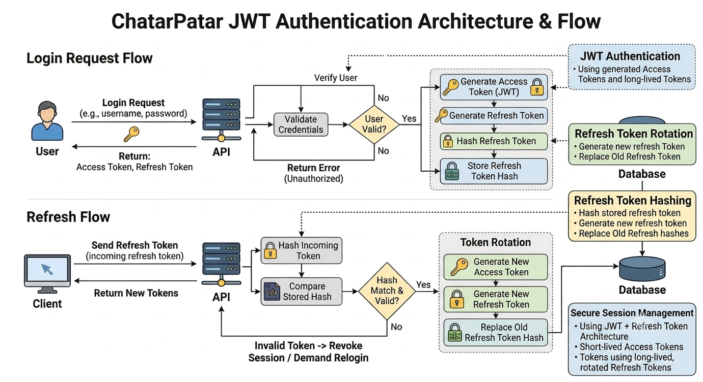
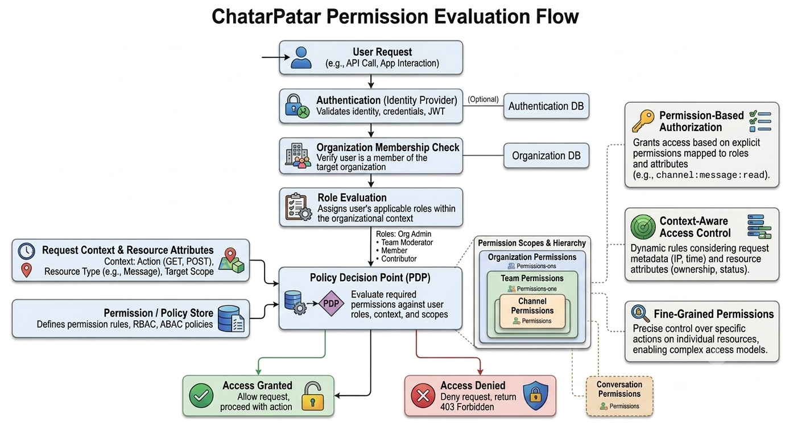
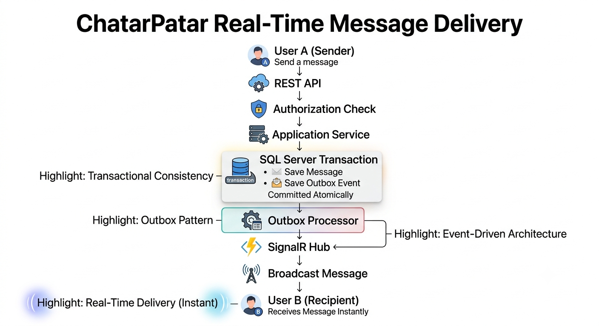
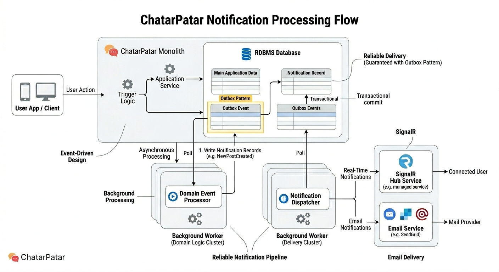
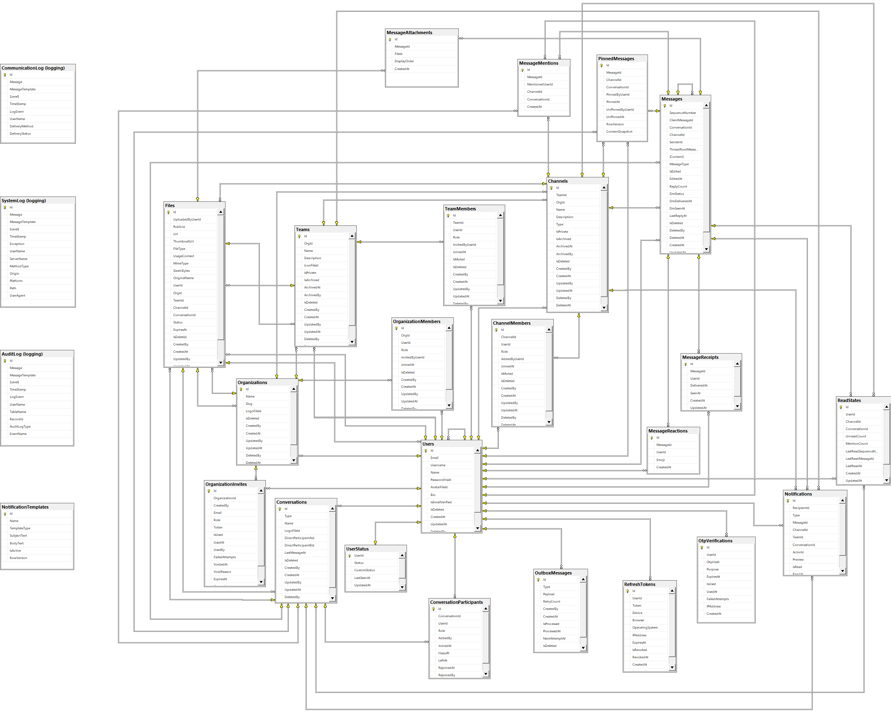

# 🚀 ChatarPatar


A modern real-time collaboration platform backend built with **ASP.NET Core**, **SignalR**, **Entity Framework Core**, and **SQL Server**.

ChatarPatar is designed to power organization-centric communication through teams, channels, direct conversations, threaded discussions, notifications, and real-time interactions. The platform combines scalable messaging capabilities with enterprise-grade concerns such as secure authentication, permission management, auditing, observability, background processing, and reliable event delivery.

---

# 📖 Overview

Modern collaboration platforms require significantly more than CRUD operations and real-time messaging. They must support secure identity management, contextual authorization, scalable communication, reliable event processing, and operational visibility.

ChatarPatar was built to explore these challenges through a layered architecture focused on:

- Real-time communication
- Secure authentication and authorization
- Reliable event-driven processing
- Scalable message retrieval
- Operational observability
- Auditability and traceability
- Data integrity and consistency
- Maintainable architecture

---

## Why ChatarPatar?

ChatarPatar was built as a learning and engineering project focused on designing a production-style collaboration backend.

The goal was not only to implement messaging features, but also to explore architectural patterns commonly used in modern distributed systems, including:

- Event-driven processing
- Reliable delivery mechanisms
- Contextual authorization
- Multi-tenant architecture
- Observability and auditing
- Scalable real-time communication

---

## 🚀 Engineering Highlights

- Real-time messaging powered by SignalR
- Multi-tenant organization architecture
- Permission-based authorization model
- JWT authentication with refresh token rotation
- Refresh token hashing
- Outbox Pattern for reliable event delivery
- Keyset pagination for message history
- Optimistic concurrency using RowVersion
- Background workers for asynchronous processing
- Structured logging with Serilog
- Audit, system, and communication logging
- SQL Server enforced data integrity

---

# ✨ Platform Capabilities

## Workspace Management

- Organizations
- Organization Members
- Organization Invitations
- Teams
- Team Memberships
- Channels
- Channel Memberships

## Communication

- Channel Messaging
- Direct Conversations
- Group Conversations
- Threaded Discussions
- Message Reactions
- Message Mentions
- Message Pinning
- File Attachments
- Read Tracking

## Real-Time Collaboration

- Live Message Delivery
- Presence Tracking
- Typing Indicators
- Live Reaction Updates
- Presence Updates
- Real-Time Notifications

## Identity & Access Management

- JWT Authentication
- Refresh Token Rotation
- Refresh Token Hashing
- Email Verification
- OTP Verification
- Password Reset Workflow
- Permission-Based Authorization

## Notifications

- In-App Notifications
- SignalR Notifications
- Email Notifications
- Unread Count Tracking

## Platform Operations

- Audit Logging
- Structured Logging
- System Logging
- Communication Logging
- Background Processing
- Outbox Event Processing
- Email Delivery Processing
- Operational Monitoring Support

---

# 🏗 Architecture

The solution follows a layered architecture that separates business rules from infrastructure concerns while promoting maintainability and extensibility.

```text
┌──────────────────────────────────────┐
│                 API                  │
│ Controllers • Middleware • SignalR   │
└───────────────────┬──────────────────┘
                    ▼
┌──────────────────────────────────────┐
│             Application              │
│ Services • DTOs • Validation         │
│ Authorization • Business Rules       │
└───────────────────┬──────────────────┘
                    ▼
┌──────────────────────────────────────┐
│            Infrastructure            │
│ EF Core • Authentication             │
│ SignalR • Notifications              │
│ Cloudinary • Background Services     │
└───────────────────┬──────────────────┘
                    ▼
┌──────────────────────────────────────┐
│              SQL Server              │
└──────────────────────────────────────┘
```

---

## Architecture Diagrams

### System Architecture



### Authentication Flow



### Permission Evaluation Flow



### Real-Time Message Delivery



### Notification Processing Pipeline



---

# 🌐 Domain Model

The platform is built around a multi-tenant collaboration model where organizations contain teams, channels, conversations, and messaging resources.

## Database ERD



---

# ⚡ Real-Time Architecture

SignalR is used to provide low-latency communication across channels, conversations, and user-specific notification streams.

### Messaging Events

- Message Created
- Message Updated
- Message Deleted
- Message Pinned
- Reaction Added
- Reaction Removed

### Presence Events

- User Online
- User Offline
- Presence Changed

### Activity Events

- Typing Started
- Typing Stopped
- Read-State Updates

### Notification Events

- Notification Created
- Notification Read
- Unread Count Updated

---

# 🔐 Security Architecture

## Authentication

The platform uses JWT Bearer Authentication with refresh token rotation.

### Features

- JWT Access Tokens
- Refresh Token Rotation
- Refresh Token Hashing
- Email Verification
- OTP Verification
- Password Reset Workflow

## Authorization

Authorization is evaluated through contextual permissions rather than static role checks.

Permissions can be evaluated against:

- Organization Context
- Team Context
- Channel Context
- Conversation Context
- User Context

This approach enables fine-grained access control while remaining flexible as the platform evolves.

---

# 📨 Notification Architecture

The notification subsystem supports both synchronous and asynchronous delivery.

### Supported Channels

- SignalR Notifications
- Email Notifications
- In-App Notifications

### Delivery Flow

```text
User Action
      ↓
Application Service
      ↓
Outbox Event
      ↓
Background Processor
      ├── SignalR Delivery
      └── Email Delivery
```

---

# 🛡 Observability & Auditing

The platform includes centralized logging and auditing mechanisms to improve traceability, diagnostics, and operational visibility.

## Structured Logging

Logging is implemented using Serilog and structured log events.

Features include:

- Request Logging
- Exception Logging
- Authentication Event Logging
- Background Processing Logs
- SignalR Event Logging
- Structured Contextual Logging

## Audit Logging

Critical business operations are captured through an audit trail.

Examples include:

- Organization Changes
- Team Management Actions
- Channel Management Actions
- Membership Changes
- Permission Updates
- Message Operations

### Benefits

- Traceability
- Operational Visibility
- Historical Activity Tracking
- Troubleshooting Support

---

# 🎯 Engineering Decisions

## Keyset Pagination

Message retrieval uses sequence-based pagination instead of OFFSET pagination.

```sql
WHERE SequenceNumber < @BeforeSequence
ORDER BY SequenceNumber DESC
```

### Benefits

- Consistent query performance
- Better scalability
- Reduced database load
- Efficient large-history retrieval

---

## Outbox Pattern

External side effects are processed asynchronously through an outbox pipeline.

### Benefits

- Reliable event delivery
- Transactional consistency
- Reduced coupling
- Improved resiliency

---

## Optimistic Concurrency

Critical entities use RowVersion-based concurrency checks.

### Benefits

- Prevents accidental overwrites
- Handles concurrent updates safely
- Improves consistency

---

## Database Integrity

Business rules are enforced at the database layer through:

- Foreign Keys
- Unique Constraints
- Check Constraints
- Composite Indexes
- Query Filters

This ensures invalid states cannot be persisted even when application-level validation is bypassed.

---

## Background Processing

Long-running and non-critical operations are executed asynchronously through hosted worker services.

### Responsibilities

- Outbox Event Processing
- Notification Dispatch
- Email Delivery
- Cleanup Operations

### Benefits

- Faster API Responses
- Better Scalability
- Improved Resiliency

---

# 🗄 Database

### Schema Overview

The database consists of approximately:

- 25+ Tables
- 100+ Foreign Key Relationships
- Multi-tenant Organization Model
- Team & Channel Hierarchies
- Conversation & Messaging Domain
- Notification Infrastructure
- Authentication & Security Components
- Audit & System Logging
- Outbox-Based Event Processing

### Core Domains

- Identity & Authentication
- Organizations & Memberships
- Teams & Channels
- Conversations & Messaging
- Notifications
- File Management
- Auditing & Logging
- Outbox Event Processing

## SQL Scripts

```text
Database
├── 00_Create_Database.sql
├── 01_Schema.sql
├── 02_Seed_Default_Data.sql
└── 03_Select_All_Table_Data.sql
```

### Script Overview

| Script                       | Description                                             |
| ---------------------------- | ------------------------------------------------------- |
| 00_Create_Database.sql       | Creates the database                                    |
| 01_Schema.sql                | Creates tables, constraints, indexes, and relationships |
| 02_Seed_Default_Data.sql     | Seeds required system data                              |
| 03_Select_All_Table_Data.sql | Utility script for inspection and troubleshooting       |

### Setup Order

```text
00_Create_Database.sql
        ↓
01_Schema.sql
        ↓
02_Seed_Default_Data.sql
```

---

# 🛠 Technology Stack

| Category              | Technology                |
| --------------------- | ------------------------- |
| Framework             | ASP.NET Core 8            |
| Real-Time             | SignalR                   |
| ORM                   | Entity Framework Core     |
| Database              | SQL Server                |
| Validation            | FluentValidation          |
| Authentication        | JWT Bearer Authentication |
| Logging               | Serilog                   |
| File Storage          | Cloudinary                |
| Background Processing | Hosted Services           |
| Notifications         | Outbox Pattern            |

---

# 📂 Solution Structure

```text
src
├── ChatarPatar.API
├── ChatarPatar.Application
├── ChatarPatar.Common
└── ChatarPatar.Infrastructure

Database
├── 00_Create_Database.sql
├── 01_Schema.sql
├── 02_Seed_Default_Data.sql
└── 03_Select_All_Table_Data.sql

docs
├── architecture.png
├── authentication-flow.png
├── permission-flow.png
├── message-flow.png
├── notification-flow.png
└── database-erd-full.png
```

---

# ⚙ Local Development

## Prerequisites

- .NET 8 SDK
- SQL Server
- Visual Studio 2022 / JetBrains Rider

## Clone Repository

```bash
git clone https://github.com/DhruviKhanpara/ChatarPatar.Server.git
cd ChatarPatar.Server
```

## Configure Environment

Update the required values in:

```json
appsettings.Development.json
appsettings.json
```

Required settings:

- SQL Server Connection String
- JWT Configuration
- Email Configuration
- Cloudinary Configuration

## Database Setup

Option 1: Execute SQL scripts from the `Database` folder.

Option 2: Apply Entity Framework migrations.

```bash
dotnet ef database update
```

## Run Application

```bash
dotnet run --project src/ChatarPatar.API
```

---

# 📸 Project Assets

```text
docs
├── architecture.png
├── authentication-flow.png
├── permission-flow.png
├── message-flow.png
├── notification-flow.png
└── database-erd-full.png
```

These diagrams provide a visual overview of:

- Layered architecture
- Authentication and token lifecycle
- Permission evaluation flow
- Real-time message delivery
- Notification processing
- Database design and relationships

---

# 🎯 What This Project Demonstrates

- Real-time communication using SignalR
- Secure authentication and session management
- Fine-grained permission-based authorization
- Event-driven notification processing
- Reliable background processing
- Auditability and observability
- Scalable message retrieval patterns
- Database design and integrity enforcement
- Layered architecture and separation of concerns

---

# 📄 License

This project is licensed under the MIT License.

---

⭐ If you find this project useful, consider giving it a star.
